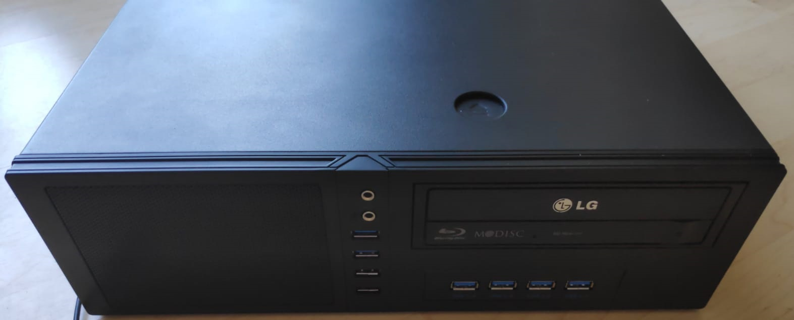
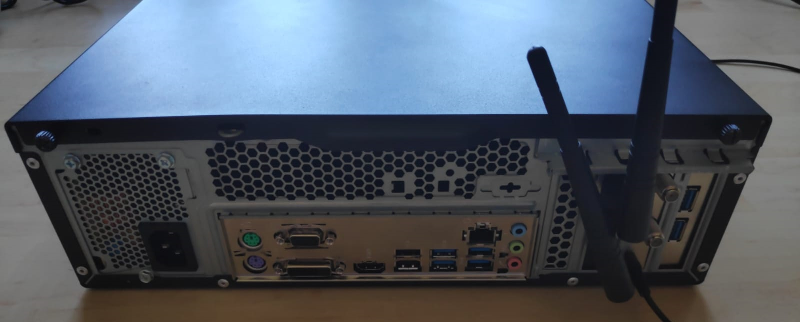
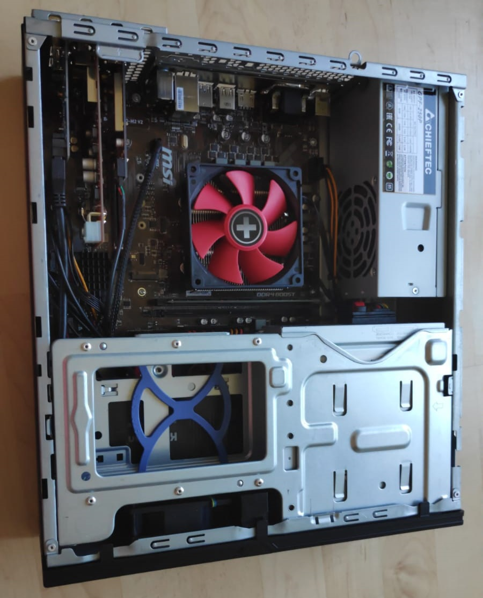
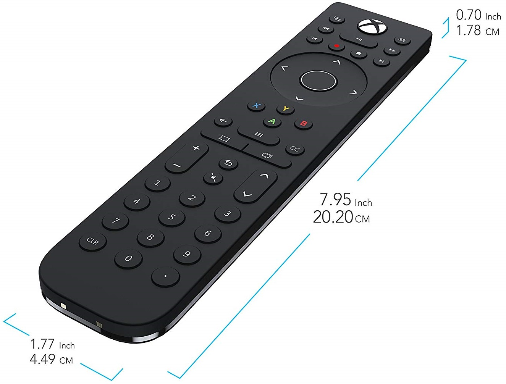

Hardware recommendations (low power consumption, fair enough for 4k playback/retro games):

* Chieftec CS-12B case
* MSI B450M MORTAR MAX AM4 mATX Motherboard
* AMD Athlon 200GE with Boxed Cooler
* 8GB DDR4-2666 RAM
* 480gb KingDian 2,5 Zoll SATA III]
* LG BH16NS40 BluRay burner
* Intel® Dual Band WLAN-AC 9260 M Wifi Adapter
* DigitalDevices Cine S2 tuner + DigitalDevices DuoFlex S2 extension, low profile bracket
* M.2 WiFi/BT to PCIe x1 Adapter, low profile bracket
* 2-Port USB 3.0 PCI-E PCI Express 19-pin USB3.0 adapter card
* 4-Port USB 3.0 Frontpanel
* Be quiet! tfx power 2 300w gold power supply
* Remote Control Xbox Talon
