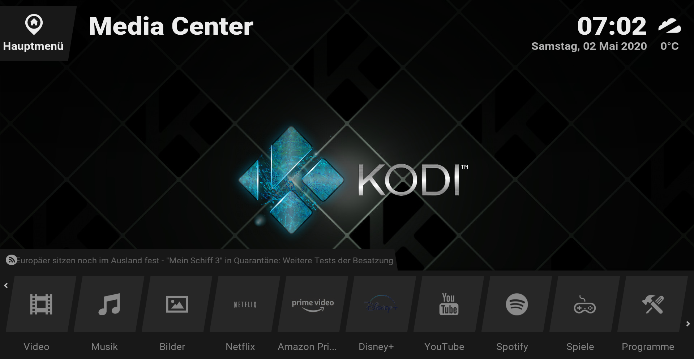
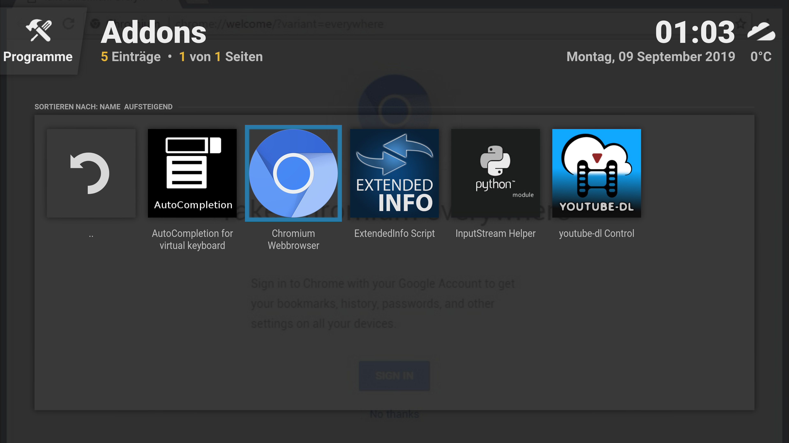
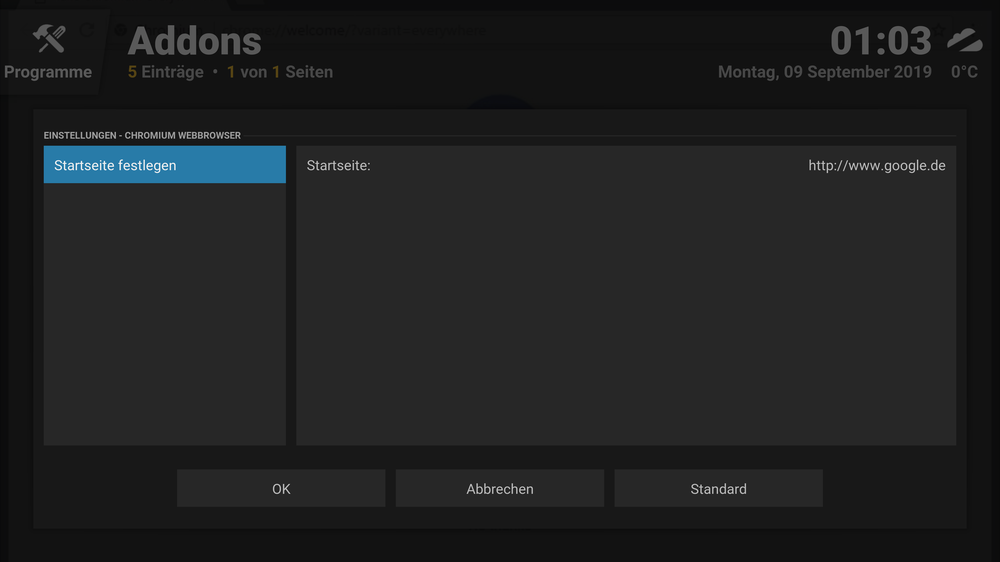
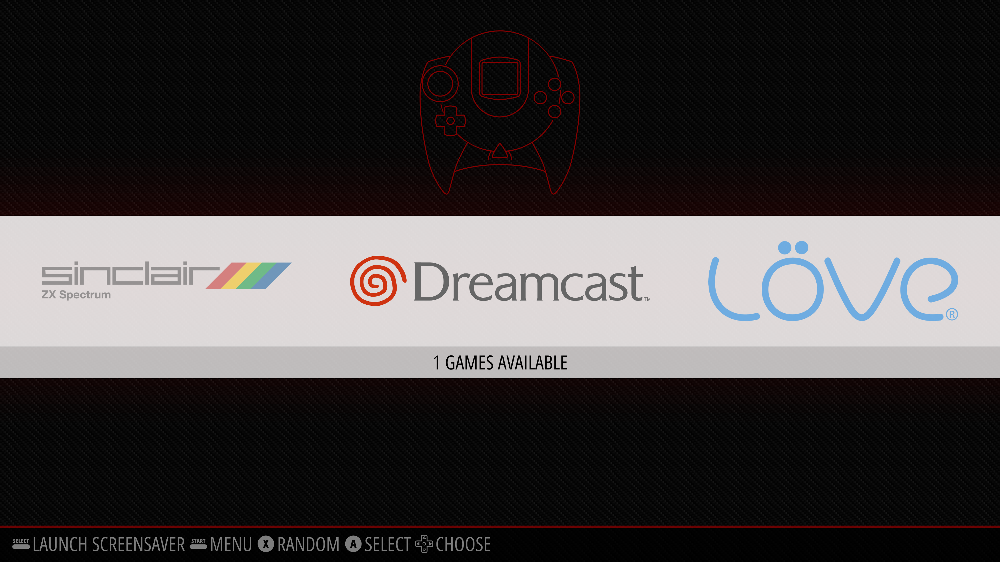
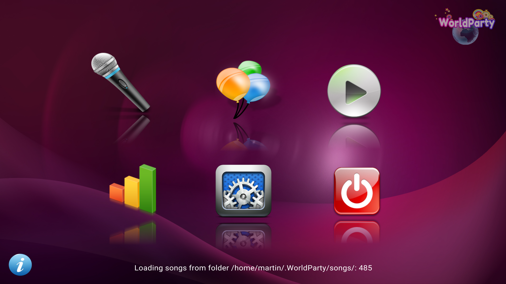

# My Ubuntu Media Center


## System
* x86/x64 devices running Ubuntu 16.04 to 20.04 or other debian derivats
* x86/x64 devices running Windows 7/8/10
* ARM devices running CoreElec/LibreElec (Khadas VIM2, Meecool KIII Pro, ...)

## How to install
### Ubuntu x86/x64
```bash
wget https://raw.githubusercontent.com/martin-doerflinger/My-Kodi-Media-Center/master/setup_ubuntu_x86_64.sh -O setup.sh
chmod +x setup.sh
./setup.sh or sudo ./setup.sh --user=<otheruser>
```

### Windows
Download [https://github.com/martin-doerflinger/My-Ubuntu-Media-Center/raw/master/setup_win_x86_x64.ps1](https://github.com/martin-doerflinger/My-Ubuntu-Media-Center/raw/master/setup_win_x86_x64.ps1)(this) setup script and open a powershell window:
```bash
set-executionpolicy remotesigned
.\setup_win_x86_x64.ps1
```

### CoreElec/LibreElec (unstable)
1. Download and extract the lastest [CoreElec](https://coreelec.org/) or [LibreElec](https://libreelec.tv/downloads_new/) firmware.
2. Burn the .img file to your sd card (or use Win32DiskImager or Rufus on Windows):
```
dd bs=1M if=image.img of=/dev/sdX conv=fsync
```
3. Navigate to the bootloader partion, open the `devices_tree` folder and copy the corresponding \*.dtb file of your device (e. g. `gxm_kvim2.dtb`) and replace the `dtb.img` file with it in the root folder of the bootloader partition.
4. Boot up your device and follow the installation instructions. Activate ssh and connect to your network.
5. Once ssh is enabled, connect to your device and rn the following commands:
```
cd ~/downloads
wget https://raw.githubusercontent.com/martin-doerflinger/My-Kodi-Media-Center/master/setup_coreelec_libreelec.sh -O setup.sh
/bin/sh -c "exec sh setup.sh"
```
6. Reboot your device


For the remote, you may have to replace some files:
* For the Khadas VIM2: `wget https://raw.githubusercontent.com/martin-doerflinger/My-Kodi-Media-Center/master/etc/rc_keymaps/khadas_small -O /storage/.config/remote.conf`
* For the Mecool KIII Pro: `echo "meson-ir * mecool" > /storage/.config/rc_maps.cfg`

For Live TV Playback, you need the following additional packages:
* TVHeadend Backend (Server)
* TVHeadend Frontend (HTSP-Client)

## Additional Images





## Disclaimer
I am not liable for any hardware damage or other problems that may occur if my script is used incorrectly. I am not responsible for the addons or applications, please do not report bugs to me which are not my fault.  I don't offer support for ROMs/Emulators at all. For legal reasons, I will not support libaacs0 and OSCam now or in the future.
